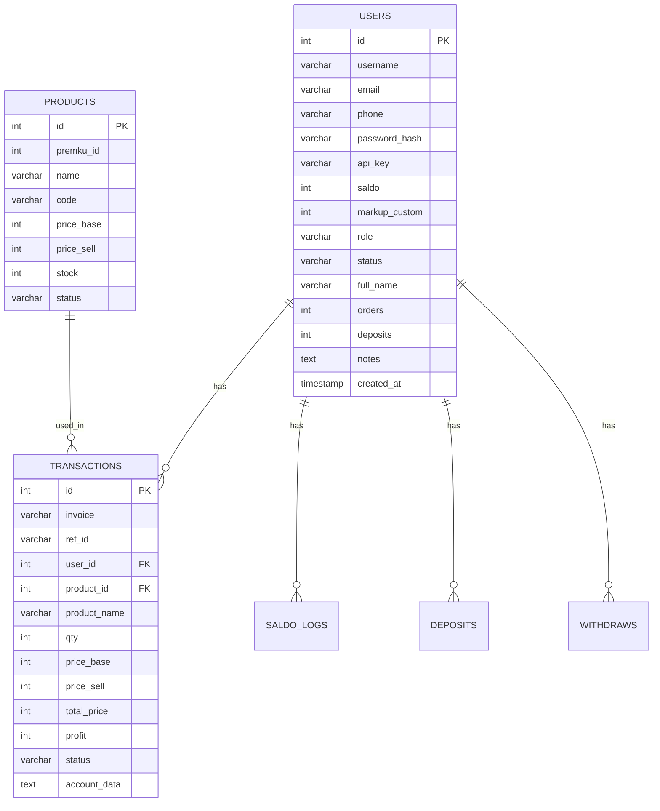

# Fase 2 - Database dan ERD

## Entity

- `users`
- `products`
- `transactions`
- `saldo_logs`
- `deposits`
- `withdraws`
- `webhook_logs`
- `settings`

## ERD

## File Implementasi

- `database/schema.mysql.sql`
- `backend/src/repositories/user.repo.js`
- `backend/src/repositories/settings.repo.js`

## Index Penting

- `users.api_key`
- `users.username`
- `transactions.invoice`
- `transactions.user_id`
- `transactions.status`
- `deposits.invoice`
- `saldo_logs.user_id`
